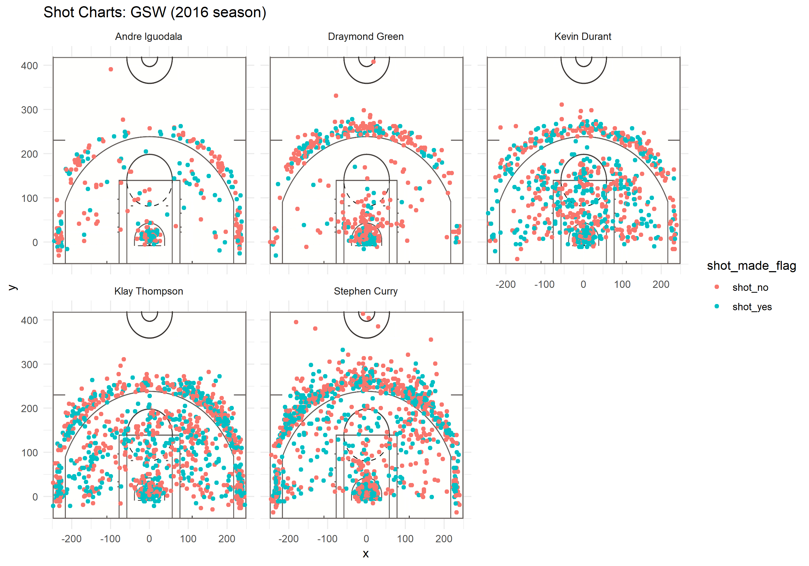

Workout 1
================
Brian Zhu

The Stats Behind the Warriors' Insane Offense
=============================================

Introduction
------------

The 2016 Warriors were a historical team. Despite not matching their previous year's regular season W/L record, they absolutely dominated the playoffs, losing only 1 game total through 4 series. They swept all of their Western Conference opponents, and then only dropped game 4 at Cleveland, who ruined their otherwise remarkable season the previous year. With the addition of Kevin Durant to their already star-studded roster, the Warriors look unstoppable for years to come. In this report, I'll be breaking down their shot charts and shooting percentages to show how formidable they are on offense. The data I will be using is from the 2016 NBA season, with the Warriors' top 5 most played players.

Data and Analysis
-----------------

Here I'll compare a few tables between the Warriors and their Finals opponents, the Cavaliers.

#### Warriors 2pt Shooting Percentages

| player         |  total|  made|   percent|
|:---------------|------:|-----:|---------:|
| Andre Iguodala |    210|   134|  63.80952|
| Kevin Durant   |    643|   390|  60.65319|
| Stephen Curry  |    563|   304|  53.99645|
| Klay Thompson  |    640|   329|  51.40625|
| Draymond Green |    346|   171|  49.42197|

#### Cavaliers 2pt Shooting Percentages

| player           |  total|  made|   percent|
|:-----------------|------:|-----:|---------:|
| Lebron James     |   1002|   612|  61.07784|
| Tristan Thompson |    434|   262|  60.36866|
| Kyrie Irving     |    979|   494|  50.45965|
| Kevin Love       |    478|   225|  47.07113|
| Iman Shumpert    |    228|   107|  46.92982|

Here, the two teams are already pretty different. The Cavs shoot A LOT more 2 point field goals, so despite having slightly lower percentages, they score significantly more than the Warriors on these.

#### Warriors 3pt Shooting Percentages

| player         |  total|  made|   percent|
|:---------------|------:|-----:|---------:|
| Klay Thompson  |    580|   246|  42.41379|
| Stephen Curry  |    687|   280|  40.75691|
| Kevin Durant   |    272|   105|  38.60294|
| Andre Iguodala |    161|    58|  36.02484|
| Draymond Green |    232|    74|  31.89655|

#### Cavaliers 3pt Shooting Percentages

| player           |  total|  made|   percent|
|:-----------------|------:|-----:|---------:|
| Kyrie Irving     |    441|   177|  40.13605|
| Lebron James     |    342|   124|  38.27160|
| Kevin Love       |    389|   145|  37.27501|
| Iman Shumpert    |    261|    94|  36.01533|
| Tristan Thompson |      3|     0|         0|

This is the biggest part of the Warriors offense. Every player on the team can knock down the 3 ball. They shoot more of these than any other team, and they shoot it well. Steph Curry is possibly the greatest 3 point shooter of all time, forcing people to think about guarding him as deep as the logo at half court. This team of all stars is revolutionizing the NBA right before our eyes.

#### Warriors Overall Shooting Percentages

| player         |  total|  made|   percent|
|:---------------|------:|-----:|---------:|
| Kevin Durant   |    915|   495|  54.09836|
| Andre Iguodala |    371|   192|  51.75202|
| Klay Thompson  |   1220|   575|  47.13115|
| Stephen Curry  |   1250|   584|  46.72000|
| Draymond Green |    578|   245|  42.38754|

#### Cavaliers Overall Shooting Percentages

| player           |  total|  made|   percent|
|:-----------------|------:|-----:|---------:|
| Tristan Thompson |    437|   262|  59.95423|
| Lebron James     |   1344|   736|  54.76190|
| Kyrie Irving     |   1420|   671|  47.25352|
| Kevin Love       |    867|   370|  42.67589|
| Iman Shumpert    |    489|   201|  41.10429|

It is interesting to note that despite the Warriors shooting many more 3 pointers, which have lower field goal chance because of the distance, the overall field goal percentage between these teams is pretty comparable.

Shot Charts
-----------

These shot charts show the truly remarkable 3 point offense that the Warriors have developed. As you can see, the Splash Brothers, Steph and Klay, take an abnormally large amount of shots from deep. These charts also show that all of these Warriors players are indeed threats from beyond the 3 point line. Durant is a scoring machine from all over the court, Iguodala and Green provide support from all around the arc as well. The Warriors' 3 point percentages are also very high, and there is a statistic called "Effective Field Goal Percentage" that adjusts for the fact that 3 point field goals are worth 1 more point than 2.

#### Effective Field Goal Percentage

| player (GSW)   |  eFG%| player (CLE)     |  eFG%|
|:---------------|-----:|:-----------------|-----:|
| Andre Iguodala |  60.5| Tristan Thompson |  60.0|
| Kevin Durant   |  59.4| Lebron James     |  59.4|
| Stephen Curry  |  58.0| Kyrie Irving     |  53.5|
| Klay Thompson  |  56.5| Kevin Love       |  51.0|
| Draymond Green |  48.1| Iman Shumpert    |  50.7|

In this chart, a couple things stand out. Steph and Klay have significantly higher eFG% than their respective opponents on the floor, Kyrie Irving and Iman Shumpert. Steph and Klay also shoot the most out of the Warriors, so that means their exceptionally high eFG% equates to a much higher score differential compared to their opponents. Another thing to note is that despite Green shooting a "low" 48.1%, he is not really a primary offensive player on the team. He is one of the best defenders in the NBA, as shown by him making the First Team All-Defensive team with the highest number of First team votes in 2016.

Conclusion
----------

The Warriors are probably the most stacked team in the NBA. They have elite defenders in Draymond Green and Andre Iguodala. However, their biggest threat is their revolutionary shooting style offense. They've brought the trend of shooting 3s to the NBA, and other teams are starting to follow. Each one of their starters is a threat at the 3 point line, and with the addition of Kevin Durant, they have arguably 3 of the highest scoring threats in the league.
