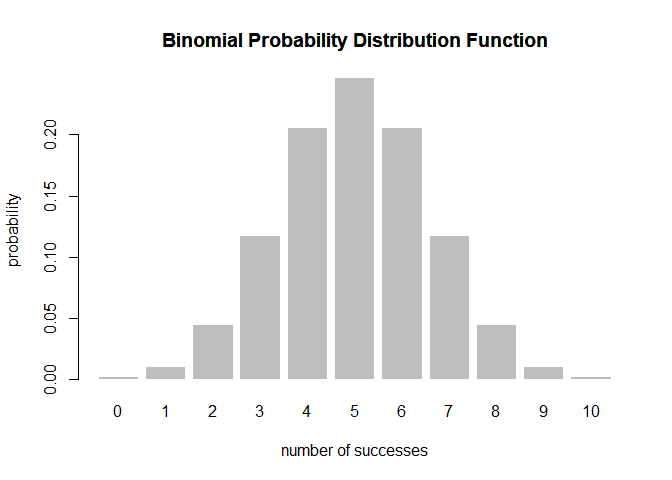

Overview
--------

The binomial distribution is a very common distribution found in probability. `"binomial"` is a simple [R](http://www.r-project.org/) package with various functions that calculate information about a binomial random variable.

-   `bin_variable()` creates a binomial random variable object (of class `"binvar"`)
-   `summary()` method for a `"binvar"` object
-   `bin_choose()` method for calculating a combination.
-   `bin_probability()` method for calculating a probability in the binomial distribution.
-   `bin_distribution()` method for finding the probability distribution.
-   `bin_cumulative()` method for finding the cumulative distribution.
-   `plot()` method for plotting the probability or cumulative distributions.

Motivation
----------

This package has been created to show basic information for a very important probability distribution.

Installation
------------

Install the development version from GitHub via the package `"devtools"`:

``` r
# development version from GitHub:
#install.packages("devtools") 
# install "binomial" (without vignettes)
devtools::install_github("brianzhu2/binomial")
# install "binomial" (with vignettes)
devtools::install_github("brianzhu2/binomial", build_vignettes = TRUE)
# note this repo is currently set to private, I'm just putting this link here as an example
```

Usage
-----

``` r
library(binomial)
# binomial variable
bin <- bin_variable(prob = 0.5, trials = 10)
bin
#> "Binomial Variable"
#> 
#> Parameters
#> - number of trials: 10
#> - probability of success: 0.5
# summary
summary(bin)
#> "Summary Binomial"
#> 
#> Parameters
#> - number of trials: 10
#> - probability of success: 0.5
#> 
#> Measures
#> - mean: 5
#> - variance: 2.5
#> - mode: 5
#> - skewness: 0
#> - kurtosis: -0.2
# probability distribution function and plot
pdf <- bin_distribution(prob = 0.5, trials = 10)
plot(pdf)
```



``` r
# cumulative distribution function and plot
cdf <- bin_cumulative(prob = 0.5, trials = 10)
plot(cdf)
```


